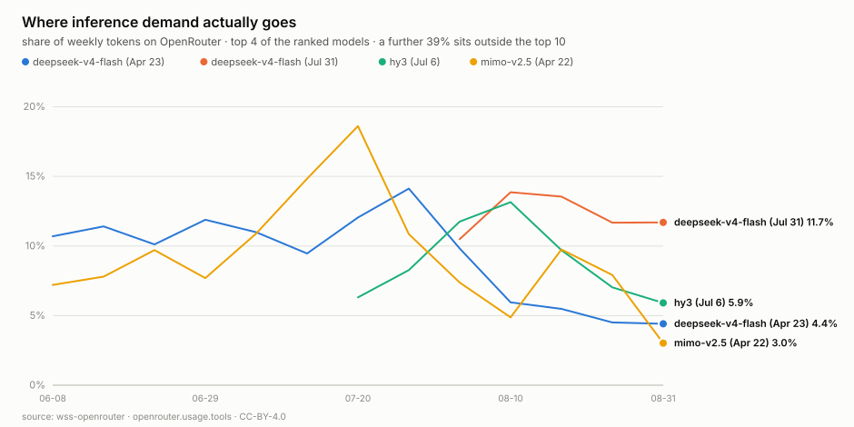

# wss-openrouter — OpenRouter Usage History

Weekly capture of **which models people actually run**, and what inference
costs. OpenRouter routes real production traffic across hundreds of models
and publishes weekly token volumes — but only for a **rolling 13-week
window**. Any week older than about three months falls off and is gone.



That chart is one capture. The endpoint hands back thirteen weeks at once, so
this repo had real history on its first day — and it already shows a clean
substitution: `deepseek-v4-flash (Apr 23)` led from June, its `Jul 31`
successor entered at zero in late July, crossed over in early August, and now
leads at 11.7% while the older version has fallen to 4.4%.

## Why this is different from download counts

Downloads, stars and likes measure **stated interest** — cheap, reversible,
and gameable. Token volume measures **revealed use**: somebody paid for that
inference. It is the closest public proxy for what is actually in production,
and nobody keeps its history.

## The data

`derived/observations/<YYYY-MM>.csv`, long format:

```
series_id, entity_id, observed_at, captured_at, metric, value, unit, source_id, raw_ref, parser_version
```

| series | metric | meaning |
| --- | --- | --- |
| `openrouter.usage.tools` | `tokens_weekly` | tokens served per model, per week |
| `openrouter.usage.images` | `tokens_weekly` | same, for image-capable use |
| both | `tokens_weekly_total` | the ranked total that week |
| `openrouter.models.catalog` | `price_prompt_usd_per_mtok` | input price, USD per million tokens |
| | `price_completion_usd_per_mtok` | output price |
| | `price_cache_read_usd_per_mtok` | cached-input price |
| | `context_length` | context window, tokens |
| | `hugging_face_id` | **join key** to `wss-hugging-face` |

`observed_at` is the week being described; `captured_at` is when we fetched
it. They differ by up to three months here, which is the point — and because
each capture restates thirteen weeks, a **revision** to an already-published
week would show up as two statements of the same week from different capture
dates, both preserved.

```bash
head derived/observations/*.csv
python examples/load_observations.py
duckdb -c "SELECT * FROM read_csv_auto('derived/observations/*.csv') LIMIT 5"
```

## The join worth making

About 180 of 417 catalogued models carry a `hugging_face_id`. That links this
repo's **token volume** to `wss-hugging-face`'s **download counts** for the
same model — stated interest against revealed use, on one entity. Divergence
between the two is the interesting quantity: models everyone downloads but
nobody serves, and models quietly carrying real traffic.

## Coverage

Machine-readable in [health/health.csv](health/health.csv)
(`first_success_at` → `last_success_at`).

| series | what it lists | covered since | status |
| --- | --- | --- | --- |
| `openrouter.usage.tools` | weekly tokens for the top 10 models | 2026-09-01 (data from 2026-06-08) | ongoing |
| `openrouter.usage.images` | same, image-capable use | 2026-09-01 (data from 2026-06-08) | ongoing |
| `openrouter.models.catalog` | prices, context limits, HF ids for every model | 2026-09-01 | ongoing |

## Caveats, stated plainly

- **Only the top 10 models are itemised.** Everything else is bucketed as
  `Others` — around 39% of tokens. The tail is invisible; the `Others` share
  is itself a concentration measure.
- **OpenRouter is not the market.** It is one router with its own user mix,
  skewed toward developers and toward models with free tiers. It is a proxy
  for production usage, not a census of it.
- **The rankings endpoint is undocumented** — it backs the public rankings
  page and `robots.txt` permits it, but it can change without notice. The
  gates require `ys` in the payload, so a shape change fails loudly rather
  than silently producing wrong numbers.
- Model ids embed dates (`…-20260731`), so a "new version" is a **new
  entity**, not a revision of the old one. That is what makes version
  substitution visible.

## How it runs

`capture-weekly` (Mondays 22:35 UTC) → `health` → `derive`, powered by the
[wss](https://github.com/neldivad/wss-engine) engine pinned to one version.
Weekly matches the data's own granularity. No workflow names a source.

## Licences

Code MIT ([LICENSE](LICENSE)); data CC-BY-4.0 ([LICENSE-DATA](LICENSE-DATA)).
Captured content comes from OpenRouter's public endpoints and remains subject
to [their terms](https://openrouter.ai/terms).

Topics: `git-scraping` · `open-data` · `point-in-time-data` · `dataset`
