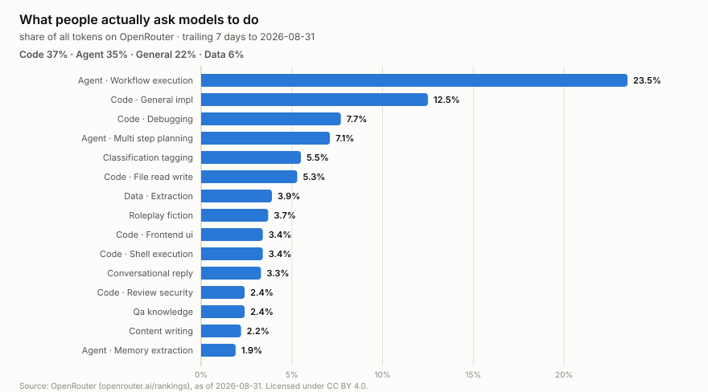

# wss-openrouter — OpenRouter Demand History

Weekly capture of **what people actually ask AI models to do**, what those
models cost, and how they score — from OpenRouter's Data API.



Agentic workflow execution alone is **23.5% of all tokens**, and Code plus
Agent together are 72% of traffic. That composition is published for a
**trailing 7-day window only** — there is no historical window, so last
month's mix is unrecoverable. That is precisely why this repo exists.

## What this repo does *not* capture, on purpose

OpenRouter's `rankings-daily` endpoint already serves daily per-model token
volumes back to **2025-01-01**, in windows up to 366 days. They archive it
properly, so capturing it would be rebuilding an archive that already exists
— and `wss validate` would reject such a source (`destroys_own_history:
false`). **Query it directly when you need it**, and cite their `meta.as_of`.

An earlier version of this repo scraped an undocumented weekly endpoint for
the same numbers. That was redundant and has been removed. What remains is
only what genuinely perishes.

## The data

`derived/observations/<YYYY-MM>.csv`, long format:

```
series_id, entity_id, observed_at, captured_at, metric, value, unit, source_id, raw_ref, parser_version
```

| series | entity_id | metrics |
| --- | --- | --- |
| `openrouter.classifications.task` | `macro:code`, `task:agent:workflow_execution`, `task:<tag>/model:<id>` | `usage_share`, `token_share`, `category_*_share`, `tag_*_share` |
| `openrouter.benchmarks.artificial-analysis` | model permaslug | `intelligence_index`, `coding_index`, `agentic_index` |
| `openrouter.benchmarks.design-arena` | `<model>/arena:<arena>/<category>` | `elo`, `win_rate`, `avg_generation_time` |
| `openrouter.models.catalog` | model permaslug | `price_prompt_usd_per_mtok`, `price_completion_usd_per_mtok`, `price_cache_read_usd_per_mtok`, `context_length`, `hugging_face_id` |

Every source stamps `observed_at` from the payload's own date (`as_of`), not
from fetch time.

```bash
head derived/observations/*.csv
python examples/load_observations.py
duckdb -c "SELECT * FROM read_csv_auto('derived/observations/*.csv') LIMIT 5"
```

## What you can build from it

- **Demand composition over time** — is agentic workflow execution still
  growing, and at whose expense? Nobody else will have this history.
- **Cost-versus-capability as a time series** — benchmark scores joined to
  catalogue prices, tracked weekly, shows the efficient frontier moving
  rather than a single snapshot scatter.
- **Which model leads which task** — the `task:<tag>/model:<id>` rows record
  the leader per task per week, so displacement is visible per workload
  rather than only in aggregate.
- **Stated interest vs revealed use** — ~180 of 417 catalogued models carry
  `hugging_face_id`, joining this repo to `wss-hugging-face` download counts.

## Setup: this repo needs an API key

**Read this before you fork:** OpenRouter's Data API is gated by *the same
key that authorises paid inference on your account*. Anyone who obtains it
can spend your credits. Treat it as a payment credential, not a read token.

1. Create a **dedicated** key at
   [openrouter.ai/settings/keys](https://openrouter.ai/settings/keys) — not
   your personal one — and set a spend limit on it if you can.
2. Copy the template and fill it in:

   ```bash
   cp .env.example .env.local
   $EDITOR .env.local          # set OPENROUTER_API_KEY and WSS_CONTACT
   chmod 600 .env.local
   ```

   `.env.local` sits at the repo root and is **gitignored** — never
   `git add` it. Verify with `git check-ignore -v .env.local`.
3. For CI, add both as **repository secrets** (Settings → Secrets and
   variables → Actions) and confirm they appear in `capture-weekly.yml`'s
   `env:` block.

Naming convention: `WSS_*` is engine configuration (`WSS_CONTACT`), while a
third-party credential keeps the publisher's own conventional name
(`OPENROUTER_API_KEY`) — the key belongs to them, not to this project.

The registry holds only the variable's *name*:

```yaml
auth:
  bearer_env: OPENROUTER_API_KEY
```

The engine sends it as a request header. It never reaches `raw/`, the
manifest, or any log — [an engine test](https://github.com/neldivad/wss-engine/blob/main/tests/test_auth.py)
asserts no file written during an authenticated capture contains the secret,
and `wss validate` refuses a credential placed in a URL query string. If a
key is ever exposed, **rotate it at OpenRouter first**; scrubbing git history
is secondary and never a guarantee.

Rate limits are 30 requests/minute and 500/day per account — ample for a
weekly capture of four sources.

## Coverage

Machine-readable in [health/health.csv](health/health.csv)
(`first_success_at` → `last_success_at`).

| series | what it lists | covered since | status |
| --- | --- | --- | --- |
| `openrouter.classifications.task` | task mix and per-task model leaders | 2026-09-01 | ongoing |
| `openrouter.benchmarks.artificial-analysis` | intelligence / coding / agentic indices | 2026-09-01 | ongoing |
| `openrouter.benchmarks.design-arena` | tournament ELO and win rates | 2026-09-01 | ongoing |
| `openrouter.models.catalog` | prices, context limits, HF ids | 2026-09-01 | ongoing |

Retired: `openrouter.usage.tools` and `openrouter.usage.images` (2026-09-01,
removed same day) — redundant with `rankings-daily`, which is archived.

## Caveats, stated plainly

- **Classifications are sampled**, and published as shares only. There are no
  absolute volumes here; composition is the question this data answers.
- **OpenRouter is not the market.** One router, developer-skewed, with its
  own model mix. A proxy for production usage, not a census of it.
- **Benchmark scores are third-party.** Artificial Analysis and Design Arena
  set their own methodologies; OpenRouter redistributes. Cite the originator.
- Token counts elsewhere in OpenRouter's data come from each provider's own
  tokenizer and are not strictly comparable across providers.

## Licences and attribution

Code MIT ([LICENSE](LICENSE)). Data CC BY 4.0 ([LICENSE-DATA](LICENSE-DATA)) —
and OpenRouter's Data API is *itself* CC BY 4.0, requiring this citation when
you republish figures:

> Source: OpenRouter (openrouter.ai/rankings), as of &lt;meta.as_of&gt;.
> Licensed under CC BY 4.0.

The `as_of` value is preserved as `observed_at` on every row, so the citation
can always be reconstructed from the data itself.

Topics: `git-scraping` · `open-data` · `point-in-time-data` · `dataset`
